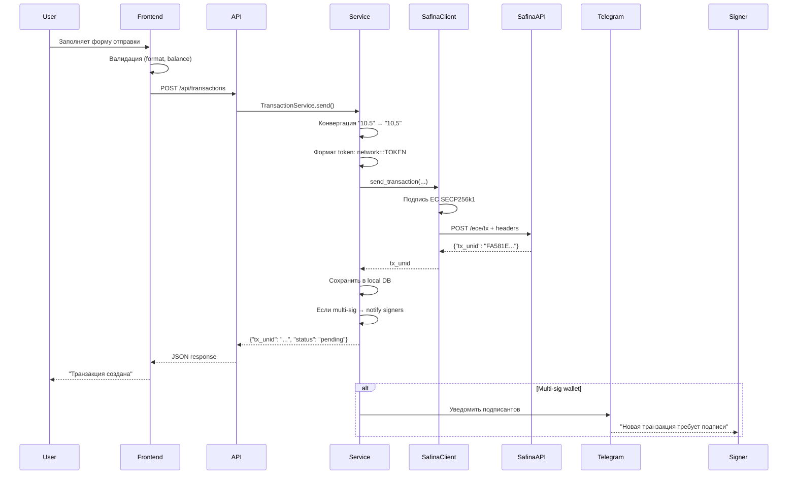
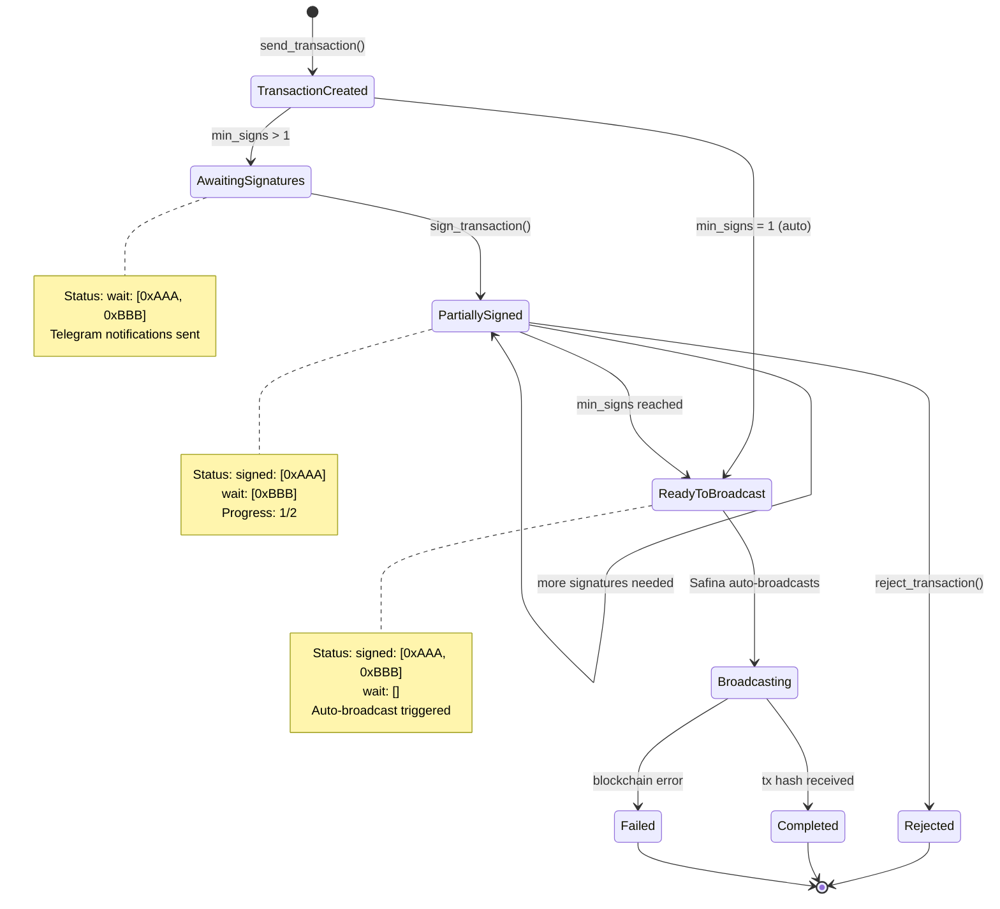
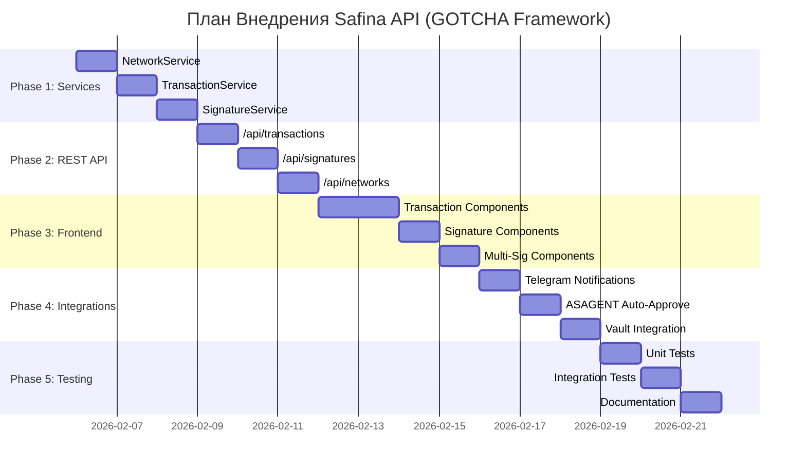

# Визуализация Внедрения Safina Pay API

## Архитектура GOTCHA для ORGON

```mermaid
graph TB
    subgraph "Слой 1: GOALS"
        G1[orgon_api_integration.md]
        G2[orgon_service_layer.md]
        G3[orgon_frontend_ui.md]
    end

    subgraph "Слой 2: ORCHESTRATION"
        O1[AI Manager]
        O2[Workflow Coordinator]
        O3[Error Handler]
    end

    subgraph "Слой 3: TOOLS"
        T1[SafinaClient<br/>19 API Methods]
        T2[TransactionValidator]
        T3[SignatureOrchestrator]
        T4[NetworkCache]
    end

    subgraph "Слой 4: CONTEXT"
        C1[API Reference]
        C2[Common Patterns]
        C3[Error Scenarios]
    end

    subgraph "Слой 5: HARDPROMPTS"
        H1[create_transaction.md]
        H2[approve_signature.md]
    end

    subgraph "Слой 6: ARGS"
        A1[safina_behavior.yaml]
        A2[safina_keys.yaml]
    end

    subgraph "Слой 7: EXPERTS"
        E1[safina_api expertise]
        E2[multisig expertise]
    end

    G1 --> O1
    G2 --> O1
    G3 --> O1
    O1 --> T1
    O1 --> T2
    O1 --> T3
    O1 --> T4
    O2 --> H1
    O2 --> H2
    C1 --> O1
    C2 --> O1
    C3 --> O3
    A1 --> T1
    A2 --> T1
    E1 --> O1
    E2 --> O1

    style G1 fill:#4a5568
    style G2 fill:#4a5568
    style G3 fill:#4a5568
    style O1 fill:#2d3748
    style T1 fill:#1a202c
    style E1 fill:#2c5282
    style E2 fill:#2c5282
```



## Поток Данных: Создание Транзакции



## Поток Данных: Мультиподпись



## Структура Layers: Реализация

```mermaid
graph LR
    subgraph "Frontend Layer"
        F1[TransactionForm.tsx]
        F2[TransactionList.tsx]
        F3[PendingSignatures.tsx]
    end

    subgraph "API Layer"
        A1[/api/transactions]
        A2[/api/signatures]
        A3[/api/networks]
    end

    subgraph "Service Layer"
        S1[TransactionService]
        S2[SignatureService]
        S3[NetworkService]
    end

    subgraph "Client Layer"
        CL[SafinaPayClient<br/>19 methods]
    end

    subgraph "External API"
        EX[Safina Pay API<br/>my.safina.pro/ece/]
    end

    F1 --> A1
    F2 --> A1
    F3 --> A2

    A1 --> S1
    A2 --> S2
    A3 --> S3

    S1 --> CL
    S2 --> CL
    S3 --> CL

    CL --> EX

    style F1 fill:#3182ce
    style F2 fill:#3182ce
    style F3 fill:#3182ce
    style A1 fill:#2d3748
    style A2 fill:#2d3748
    style A3 fill:#2d3748
    style S1 fill:#1a202c
    style S2 fill:#1a202c
    style S3 fill:#1a202c
    style CL fill:#2c5282
    style EX fill:#742a2a
```

## Интеграции: ASAGENT + Telegram + Vault

```mermaid
graph TB
    subgraph "ORGON Backend"
        ORG[TransactionService]
        SIG[SignatureService]
    end

    subgraph "ASAGENT System"
        ASA[Gateway Bot]
        AUTO[Auto-Approve Workflow]
        VAULT[Vault - Private Keys]
    end

    subgraph "External"
        TG[Telegram]
        SF[Safina API]
    end

    ORG -->|create tx| SF
    SF -->|tx_unid pending| SIG
    SIG -->|notify| TG
    TG -->|alert| User
    User -->|/approve command| ASA
    ASA -->|delegate| AUTO
    AUTO -->|fetch key| VAULT
    AUTO -->|sign_transaction| SF
    SF -->|broadcast| Blockchain
    SF -->|status update| ORG

    style ORG fill:#2d3748
    style SIG fill:#2d3748
    style ASA fill:#2c5282
    style AUTO fill:#2c5282
    style VAULT fill:#742a2a
    style TG fill:#3182ce
    style SF fill:#742a2a
```



## Фазы Реализации



## Матрица Покрытия API

| Layer | Networks | Wallets | Tokens | Transactions | Signatures |
|-------|----------|---------|--------|--------------|------------|
| **Client** | ✅ Complete | ✅ Complete | ✅ Complete | ✅ Complete | ✅ Complete |
| **Service** | ❌ TODO | ✅ Complete | ⚠️ Partial | ⚠️ Partial | ❌ TODO |
| **REST API** | ❌ TODO | ✅ Complete | ⚠️ Partial | ❌ TODO | ❌ TODO |
| **Frontend** | ❌ TODO | ✅ Complete | ⚠️ Partial | ❌ TODO | ❌ TODO |

**Legend:**
- ✅ Complete — Полностью реализовано
- ⚠️ Partial — Частично, требует улучшений
- ❌ TODO — Не реализовано

## Критические Точки Внимания

### 🔴 CRITICAL: Decimal Separator
```
❌ НЕПРАВИЛЬНО: "10.5" → Safina вернет ошибку подписи
✅ ПРАВИЛЬНО:   "10,5" → Safina примет
```

### 🔴 CRITICAL: Token Format
```
❌ НЕПРАВИЛЬНО: "TRX"
✅ ПРАВИЛЬНО:   "5010:::TRX###945C6F4C54B3921F4625890300235114"
                network:::TOKEN###wallet_name
```

### 🔴 CRITICAL: JSON Signing
```javascript
❌ НЕПРАВИЛЬНО:
const body = JSON.stringify({network: "5010", info: "Test"})
// Результат: '{"network": "5010", "info": "Test"}' (пробелы!)

✅ ПРАВИЛЬНО:
const body = JSON.stringify(data, null, 0)
// Или явно:
const body = JSON.stringify(data, null, 0).replace(/\s/g, '')
// Результат: '{"network":"5010","info":"Test"}'
```

### ⚠️ WARNING: Signature Headers
```python
headers = {
    "x-app-ec-from": "0xA285990a1Ce696d770d578Cf4473d80e0228DF95",  # ✅ 0x prefix
    "x-app-ec-sign-r": "0xdb07295a5f...",  # ✅ 0x prefix
    "x-app-ec-sign-s": "0x3a64d736044...", # ✅ 0x prefix
    "x-app-ec-sign-v": "0x1b"  # ✅ 0x1b or 0x1c (27/28 в hex)
}
```

## Следующие Шаги

1. **Немедленно:**
   - [ ] Создать `backend/services/network_service.py`
   - [ ] Создать `backend/services/signature_service.py`
   - [ ] Улучшить `backend/services/transaction_service.py`

2. **Сегодня:**
   - [ ] Создать REST API endpoints `/api/transactions/*`
   - [ ] Создать REST API endpoints `/api/signatures/*`
   - [ ] Unit тесты для сервисов

3. **Завтра:**
   - [ ] Frontend компоненты транзакций
   - [ ] Frontend компоненты подписей
   - [ ] Integration тесты

4. **На этой неделе:**
   - [ ] Telegram интеграция
   - [ ] ASAGENT auto-approve
   - [ ] Vault хранение ключей
   - [ ] Финальное тестирование

---

**Примечание:** Этот документ — визуальное дополнение к основному плану `GOTCHA_API_IMPLEMENTATION_PLAN.md`. Используйте оба документа вместе для полного понимания архитектуры.
