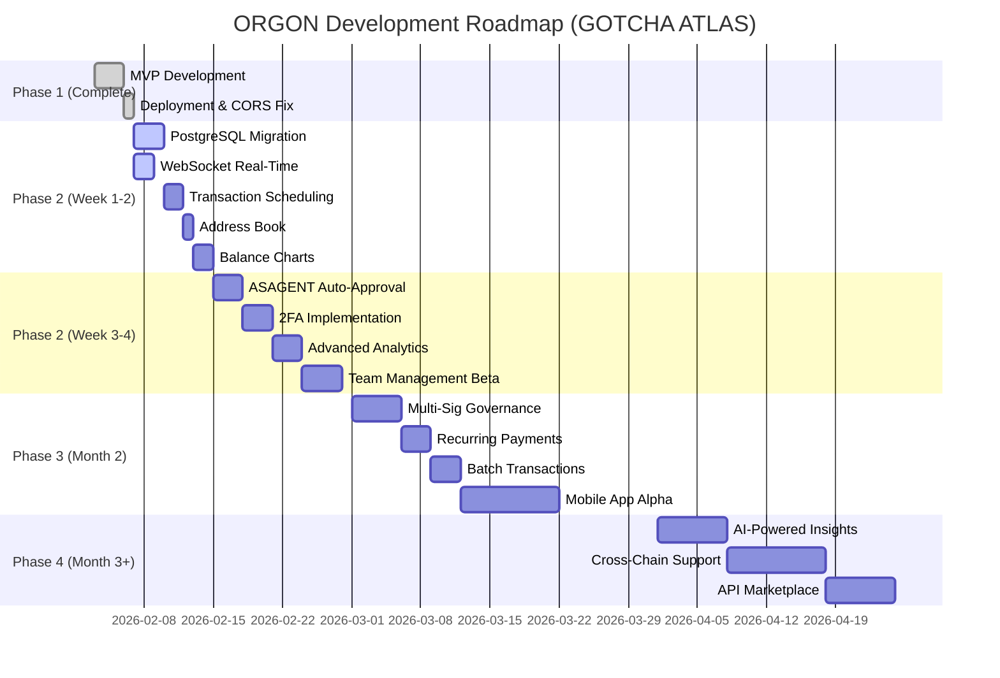
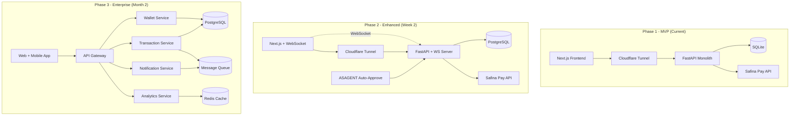
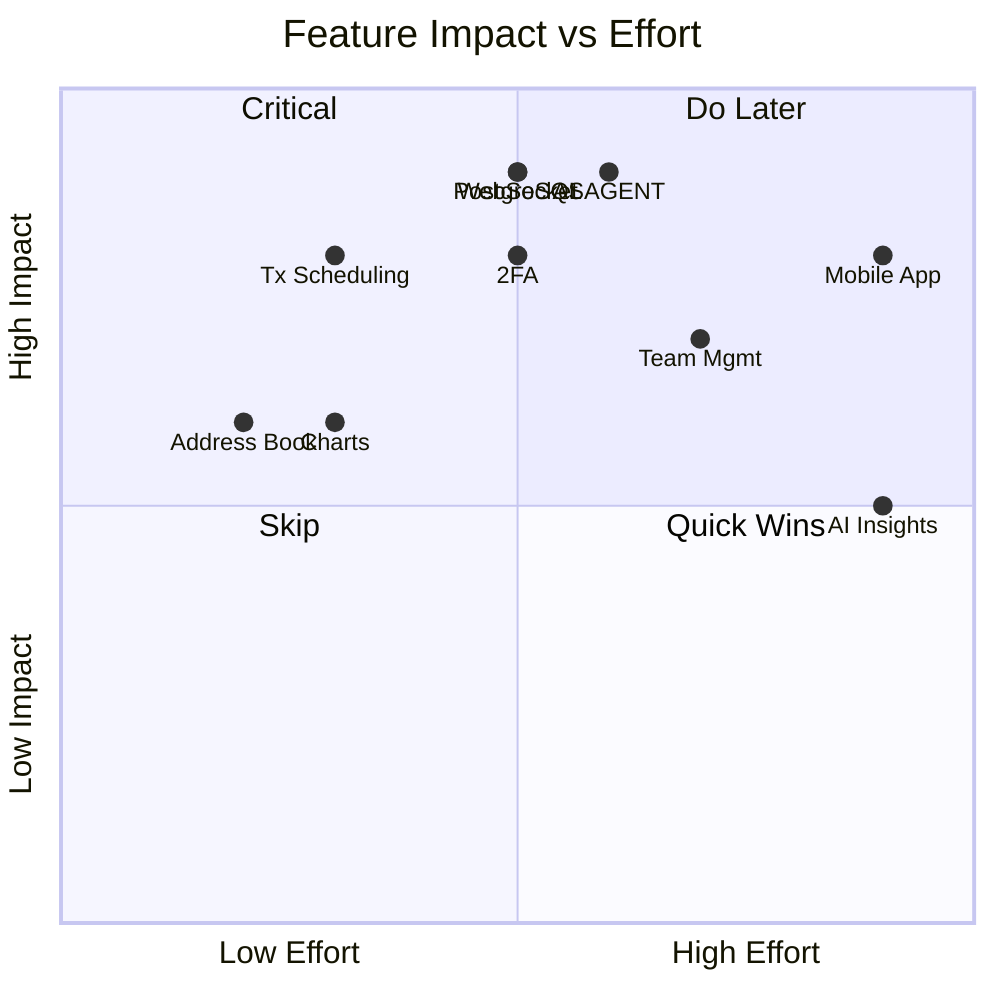
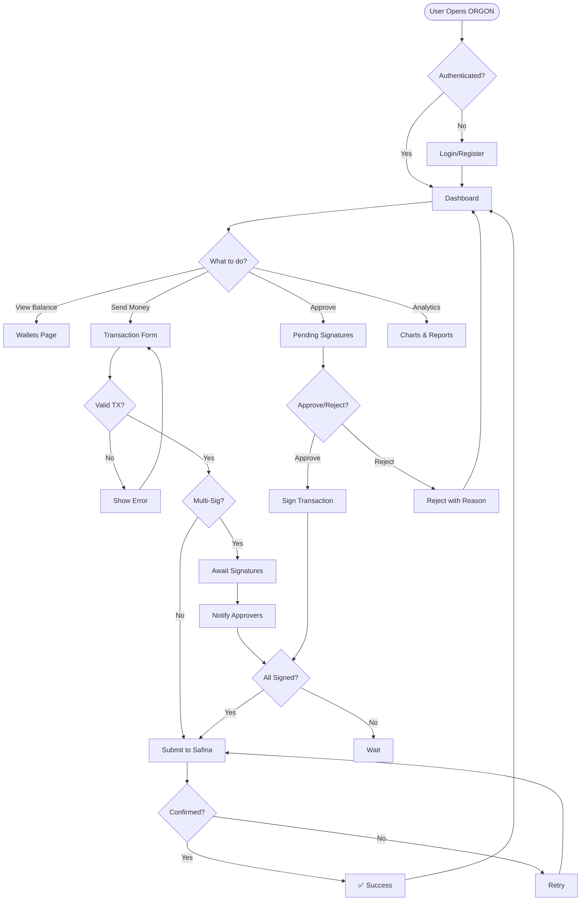
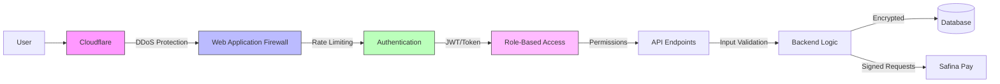
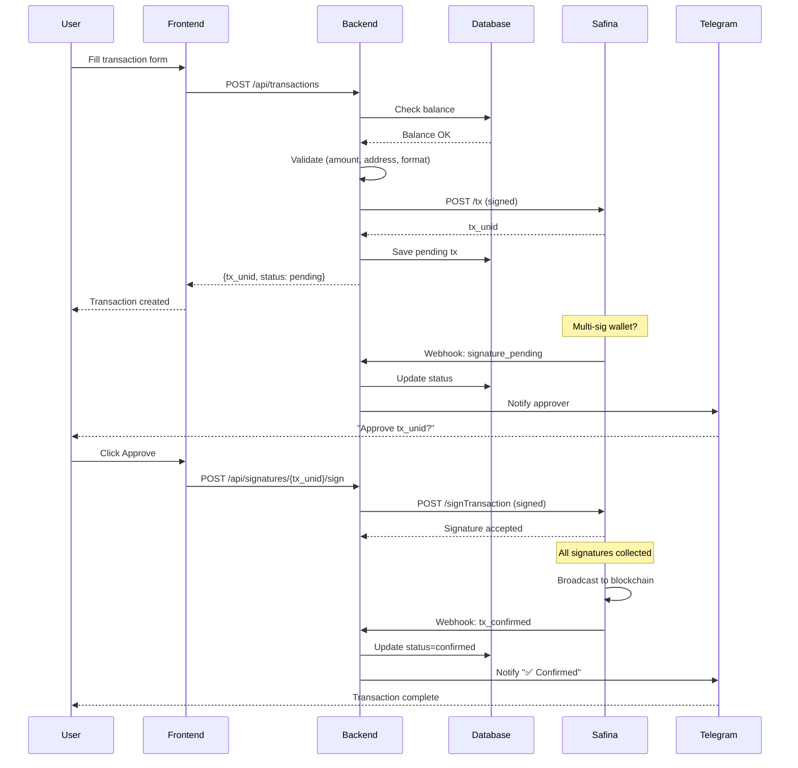
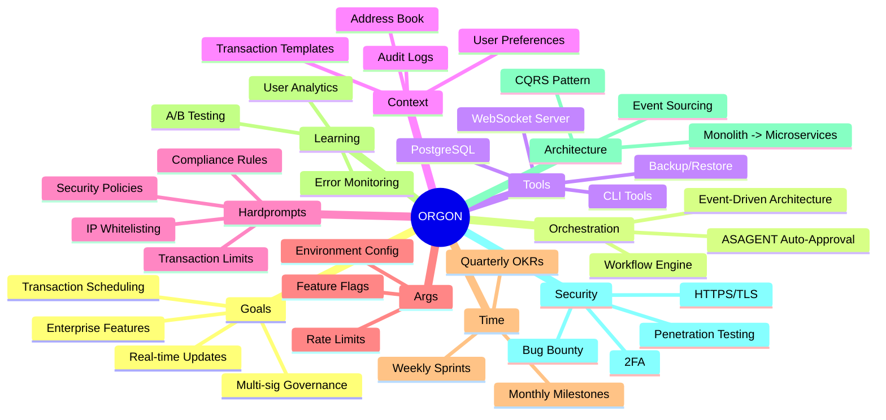
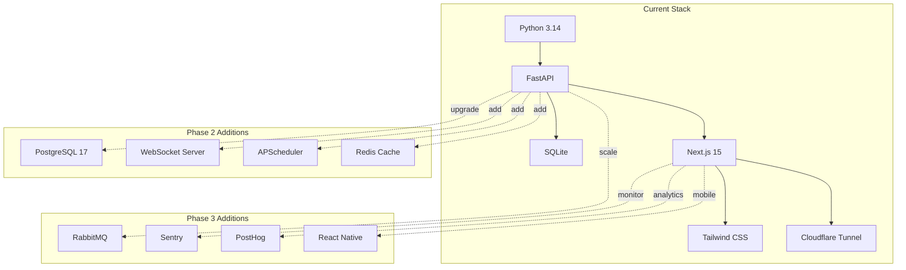
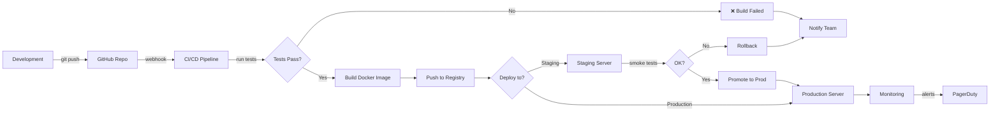

# ORGON Development Timeline — Visual Roadmap

---

## Architecture Evolution

---

## Feature Priority Matrix

---

## User Journey Flow

---

## Security Layers

---

## Data Flow — Transaction Lifecycle

---

## GOTCHA ATLAS Framework Mapping

---

## Tech Stack Evolution

---

## Deployment Pipeline

---

## Monthly Milestones

| Month | Theme | Key Features | Success Metric |
|-------|-------|--------------|----------------|
| **Feb 2026** | Foundation | MVP deployed, PostgreSQL, WebSocket | 50+ wallets, 1000+ tx |
| **Mar 2026** | Automation | ASAGENT, scheduling, recurring payments | 80% auto-approval rate |
| **Apr 2026** | Enterprise | Team mgmt, 2FA, advanced analytics | 10+ team accounts |
| **May 2026** | Mobile | React Native app, push notifications | 500+ app downloads |
| **Jun 2026** | Intelligence | AI insights, anomaly detection | <1% false positives |
| **Jul 2026** | Ecosystem | API marketplace, 3rd-party integrations | 5+ integrations live |

---

**Visualization Tools:**
- Mermaid: https://mermaid.live
- Gantt Chart: Project timeline
- Quadrant Chart: Priority matrix
- Flowchart: User journeys
- Sequence Diagram: Data flows

**Last Updated:** 2026-02-06 14:30 GMT+6
